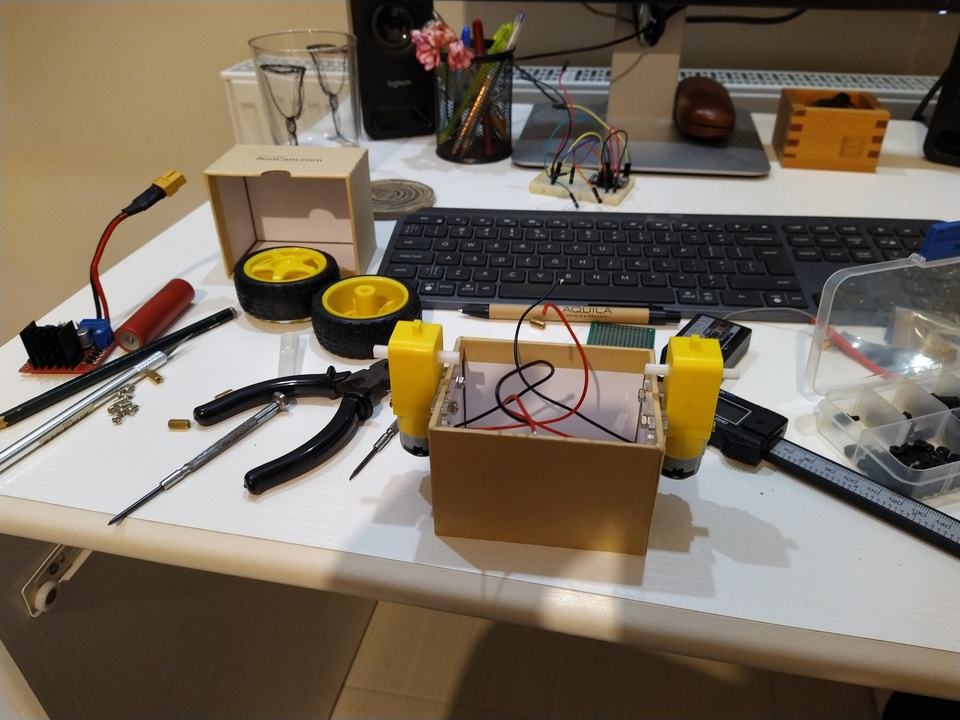

# Wheely

Yet another, balancing robot.

Features:

- In a cardboard box
- RC Controlled
- buzzer / audio feedback / tunes

## Electronics

- Arduino [Micro](docs/leonardo-micro.png)
- MPU6050
- L298 Motor driver
- 2x Geared toy DC motors and wheels
- Buzzer
- Turnigy 9X8C PWM Receiver

## Other parts

- cardboard box for a frame (I used the box of a runcam)
- velcro straps to hold battery in place
- jumper wires, screws, spacers etc

## Libraries

- PID lib for arduino
- L298NX2 for motor control
- ServoInput [lib for PWM and PPM](https://github.com/dmadison/ServoInput)
- MPU6050_tockn (using the i2c unterface, no interrupt)

[Pin Reference and Docs](https://www.arduino.cc/en/reference/wire)

[MPU6050 docs](https://components101.com/sensors/mpu6050-module)

## Pins used on the Micro

- MotorA: 5 (PWM), 18, 19
- MotorB: 6 (PWM), 20, 21

- I2C (for IMU): 2 (SDA), 3 (SCL)
- RC Receiver: Available with interrupt 0,1 (serial RX, TX) and 7.
- Buzzer: Pin 10 (PWM)

### Receiver Channel to Arduino pin

- CH1 -> PIN1 (frw/rev, pitch)
- CH2 -> PIN0 (left/right, roll)
- CH6 -> PIN7 (pot for trimming neutral position)

## Build

1. The box used for the robot frame.

2. Motors installed on the bottom part.

3. Motor driver is hole positions.

4. Motor driver installed (screwed) on the bottom of the box. The power switch is also placed on the side. The switch was moved to a better location after initial tests. Using jumper wires for everything has the advantage that i can rearange stuff easilly, but it is a bit messy.

5. MPU is installed on the top side of the box. Secured in position with plastic screws and spacers. The rest of the electronics (arduino, buzzer) go inside the box with the motor driver.

6. Testing if the receiver can also fit on the bottom. It could but I decided to put it on the top in the end. The buzzer is also visible in the photo.

7. Installation of the receiver on the top half of the box.

8. Two velcro straps hold a 3s battery on the bottom, 1300mahs are enough for more than an hour of running time.

